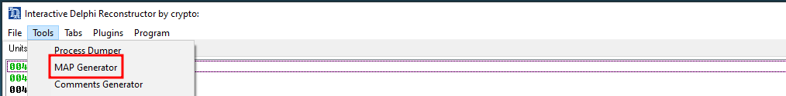

# Delphi Mapper (v0.1)
Author: **Claudio Teixeira**

_A plugin that renames Delphi functions according to a .map file produced by IDR._

## Description:

Parses a .map file produced by IDR (Interactive Delphi Reconstructor) and replaces the names of functions at their corresponding adresses.

To acquire a MAP file:

## Minimum Version

This plugin requires the following minimum version of Binary Ninja:

* 2784

## License

This plugin is released under a MIT license.
## Metadata Version

2
